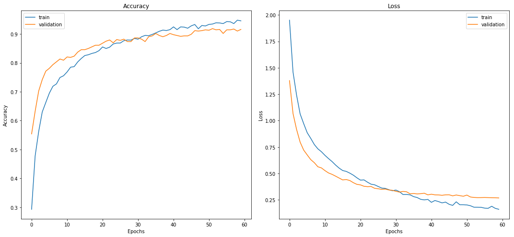
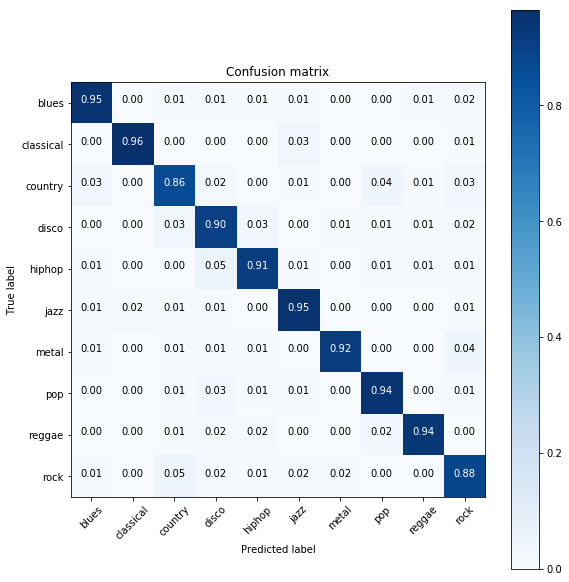
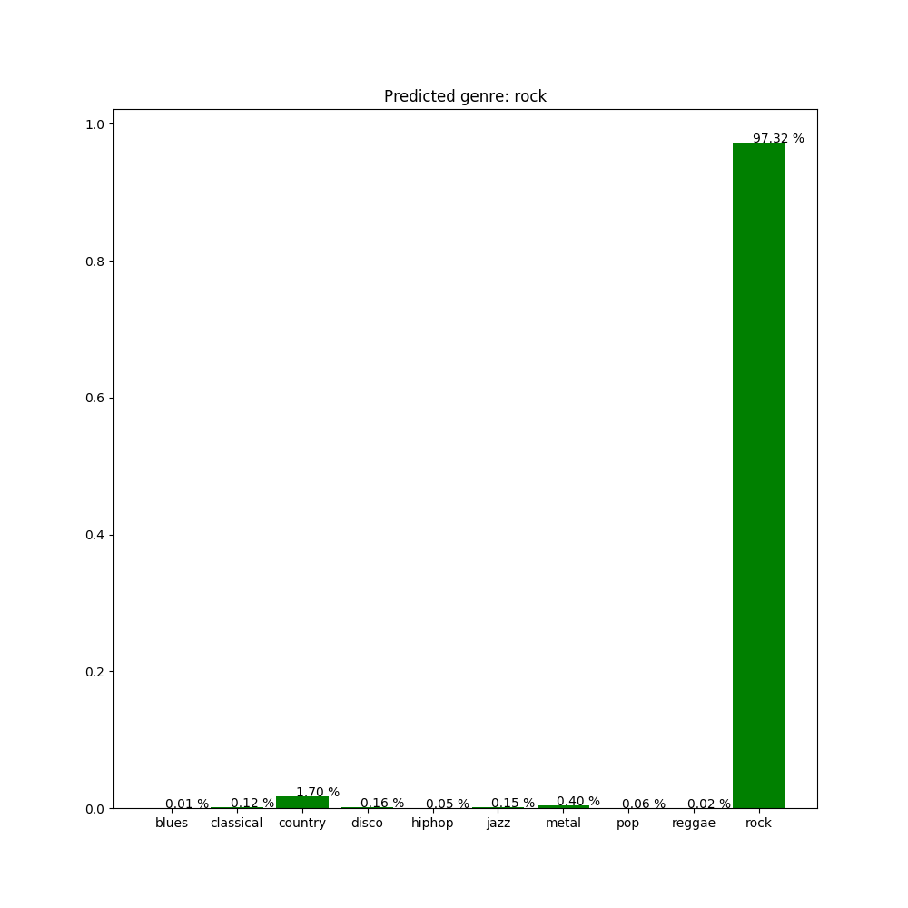

# Music Classifier

As my final project for Ironhack's Data Analytics Bootcamp I decided to develop a music classification system that would use Neural Networks to predict the genre of new songs. In this repository you can find all the necessary files to run the source code and test it yourself. You can also train/test the model with your own music if you wish, I've added a *feature extraction* and a *train/test* mode using **argparse** for that purpose (I will explain how later on).

In the **Presentation/demo_videos/** folder you can find videos showing how my project works. This is a step by step guide for you to follow if you wish to try my **Music Classifier** yourself. On this guide I will also explain the methodology I followed and the results I got:

## 0. Fork/clone this repo
As usual, the first step is to fork this repo and clone/download it on your computer. That way you will have the same folder structure and everything should run smoothly if you take into account the following considerations:

### i. Train data acquisition and conversion:

I haven't uploaded the songs data set I used to train and test the model, but you can find it here: http://opihi.cs.uvic.ca/sound/genres.tar.gz.

Just dowload and extract the files in the **Data** folder of this project. The structure should look like this:

The dataset consists of 1000 audio tracks each 30 seconds long. It contains 10 genres, each represented by 100 tracks. The tracks are all 22050Hz Mono 16-bit audio files in *.au* format. You will also need to convert each file from *.au* to *.wav* (I used **SoX** for this: http://sox.sourceforge.net/).

Also, I left out of one song of each genre so I could use them later for testing (you can find these in the **Data/test_songs/** folder), so the actual training of the neural network is done with the first 99 songs of each genre. If you wish to test the training mode, make sure to remove the last song of each genre so you can replicate my results.

### ii. Python version, libraries and software:

This project uses **Python 3.6** as more recent versions are not supported by Keras (one of the main libraries/frameworks I've used). I would recommend you to create a virtual environment (using conda, virtualenv, or whichever you prefer) and installing the Python version and libraries specified in the **requirements.txt**. You should make sure you have installed:

|  Name 	|  Description 	|
|---	|---	|
|   [Python 3.6](https://www.python.org/downloads/release/python-369/)	|   Python version currently supported by Keras	|
|   [Librosa](https://librosa.github.io/librosa/)	|   Python package for music and audio analysis	|
|   [Pandas](https://pandas.pydata.org/)	|   Provides easy-to-use data structures and data analysis tools for Python	|
|  [Numpy](https://numpy.org/)	|   Python package for scientific computing	|
|   [Scipy](https://www.scipy.org/)	|   Provides many user-friendly and efficient numerical routines for python 	|
|   [Matplotlib](https://matplotlib.org/)	|   Python 2D plotting library	|
|   [Scikit-learn](https://scikit-learn.org/stable/)	|   Machine learning library for Python	|
|   [TensorFlow](https://www.tensorflow.org/)	|   Machine learning library for Python	|
|   [Keras](https://keras.io/)	|   Neural Networks library for Python that runs on TensorFlow	|
|   [Urllib3](https://urllib3.readthedocs.io/en/latest/)	|   HTTP client for Python	|
|   [Python-dotenv](https://pypi.org/project/python-dotenv/)	|   Reads the key,value pair from .env file and adds them to environment variable	|
|   [Spotipy](https://spotipy.readthedocs.io/en/latest/)	|   Python library for the Spotify Web API	|
|   [mpg123](https://www.mpg123.de/index.shtml)	|   MPEG console audio player and decoder for Linux, Windows and Mac	|

### iii. Spotify developer account:

I've developed an integration with Sporify's Web API that allows the user to search and download previews of new songs and then test the model with these. It's a pretty cool feature and I highly recommend you to try it. You'll need **Spotify developer** credentials to make this feature work, but don't worry, it's very easy to set it all up:

**1. Connect Spotify developer to your Spotify account:** it takes less than 5 minutes, you just need to go to this [website](https://developer.spotify.com/dashboard/) and click on *"Sign up for a free Spotify account here."*. Then click on *Create a Client ID* and follow the instructions. You will get a *Client ID* and a *Client Secret*.

**2. Add your ID and Secret to environment variables:** create a *.env* file in the **root** folder, open it with your favourite text editor and type your ID as *CID = "WhateverYourClientIdIs"* and your Secret as *SECRET = "WhateverYourSecretIs"*.

### Once you're done with this, everything should work like a charm.

## 1. *Feature extraction* and *train* mode

As I mentioned before, you can train the model with your own music if you want to. You just need to make sure to put your music in the **Data/genre/** folder as I previously showed. All files must be correctly labelled. However, if you wish to add new/different genres you'll need to tweak the code a little bit (just modify the *GENRES* dictionary on **feature_extraction.py** and **demo1.py**).

I will explain how it works with the original dataset:

### Feature extraction:

This is the first step of my project and also the first challenge. We are dealing with audio files which we need to "translate" into numbers and other types of data that we can later use to train the Neural Network. I used a library called **Librosa** to extract a series of features (which I chose after thorough research) from each audio file. Then I calculated certain statistics (mean, standard deviation, kurtosis and skewness) for each of these features and saved them to a *.csv* (which you can find in **Features/dataset_features**). This is the data I trained and tested the model with.

I had some trouble training the Neural Network with this data alone. After all, it was only 99 songs per genre to train with which is not a lot of data. What I did to increase my dataset was splitting each song into 9 different parts before the feature extraction. This way I could have 9 times more data and the accuracy of the model improved by nearly 10%.

If you want to test this just run <code>python main.py -f</code> on your terminal from the project's folder. This will read all the training songs, split them, extract their features and save them to the *.csv*.

### Training:

I've saved my trained model in the **Models** folder so you can run the test mode directly, but you can also train the model again if you wish to. I used a sequential model with 4 fully connected layers and 3 dropout layers between them. The last layer has 10 weights (based on 10 possible music genres) and gives the output or prediction of the model. If you want to train the model with your own music and want to add/remove genres make sure to modify the network's architecture as well or it won't work.

To train the model run <code>python main.py -t</code> on your terminal from the project's folder. This will read the features *.csv* and prepare the data (normalize it using a standard scaler and split it into train and test samples), then it will train the model and saved the result in the **Models** folder.

The results I got where pretty good as you can see from the accuracy-loss plot and the confusion matrix:

## 2. Demo modes

Whether you have already trained the model with your own data or you just want to test my trained model, you can run the demo modes I've developed. Both demos do basically the same thing: they read an audio file of your choice, extract its features, normalize the data, save it to a *.csv* (found in **Features/singel_song_features/**) and then make a prediction with the model. The results are shown on a bar plot (saved in the **Output** folder) that describe the confidence with which the model predicts each of the genres for a single song, just like this one:

With a little help from my professors I was able to apply threading on this part of the project, which makes it possible to play the test song from terminal (using **mpg123**) while the model makes its predictions.

Now, here's how you run the demo modes:

### Normal demo mode:

If you want to test the model with a song you already have in your computer you need to run <code>python main.py -d -p path_to_your_song/song.mp3</code> on your terminal from the project's folder. **Make sure your song is in *.mp3* format**. You can also use the songs in the **Data/test_songs/** folder. If you don't specify a path to an audio file the program will test a default song (**Data/test_songs/classical.mp3**).

### Spotify demo mode:

On this mode you can look for a song in Spotify and test the model with a preview of that song. To try it you just need to run <code>python main.py -s</code> on your terminal from the project's folder. 

The program will prompt you for the name of the artist and song, it will then look for it in spotify and show you a list of the top 10 results (in case you're looking for a specific version of the song). Once you choose one of the results, the preview for that song will be downloaded in **Data/unlabelled_songs/** and it will be used to test the model. Certain songs/artists have no previews available in Spotify, just try another song in that case.

## Future improvements

I'm quite happy with the outcome of my project, but there's always room for improvement. Some of the next steps are:

* **Enriching the dataset:** when you test the model on more modern songs (specially songs that mix different genres) the predictions can be a little bit off. This is not a surprise considering the limited amount of songs and genres we are training the model with. Also, the songs in the dataset were gathered almost 20 years ago, so it may be a little outdated. Obtaining new songs and genres should be relatively easy using Spotify's previews and will give us a more robust model.

* **Trying new architectures and approach:** this problem can be easily turned into and image classification one. If we obtain the spectogram for each song and save it as a numpy array we could use a convolutional neural network for image classification (such as VGG16). It would be interesting to try this approach and see if we obtain better results.

* **Enabling microphone use:** i want to try using the computer's microphone to listen to a song the user may be playing in another device. This would be specially interesting with live music, sort of a *Shazam* that classifies music by genre rather than guessing name and artist.

I must say I had a lot of fun doing this project and this bootcamp. To me it was the perfect closure for such an amazing experience. I hope you have fun trying out this project.

