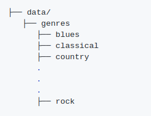

# Music Classifier

As my final project for Ironhack's Data Analytics Bootcamp I decided to develop a music classification system that would use Neural Networks to predict the genre of new songs. In this repository you can find all the necessary files to run the script and test it yourself. You can also train/test the model with your own music if you wish, I've added a feature extraction and a train/test mode using **argparse** for that purpose(I will explain how later on).

So, this is a step by step guide for you to follow if you wish to try my **Music Classifier** yourself. *On this guide I will also explain the methodology I followed and the results I got*:

## 0. Fork/clone this repo:
As usual, the first step is to fork this repo and clone/download it on your computer. That way you will have the same folder structure and everything should run smoothly if you take into account the following considerations:

### i. Train data acquisition and conversion:

I haven't uploaded the songs data set I used to train and test the model, but you can find it here: http://opihi.cs.uvic.ca/sound/genres.tar.gz.

Just dowload and extract the files in the **Data** folder of this project. The structure should look like this:

The dataset consists of 1000 audio tracks each 30 seconds long. It contains 10 genres, each represented by 100 tracks. The tracks are all 22050Hz Mono 16-bit audio files in .wav format. You will also need to convert each file from .au to .wav (I used SoX for this: http://sox.sourceforge.net/).

Also, I used left out of each genre so I could use them later for testing (you can find these in the **Data/test_songs/** folder), so the actual training of the neural network is done with the first 99 songs of each genre. If you wish to test the training mode, make sure to remove the last song of each genre so you can replicate my results.

### ii. Python version, libraries and software:

This project uses **Python 3.6** as more recent versions are not supported by Keras (one of the main libraries/frameworks I've used). I would recommend you to create a virtual environment (using conda, virtualenv, or whichever you prefer) and installing the Python version and libraries specified in the **requirements.txt**. These are the most important ones:

The dataset I'll be using for this project can be found here: http://marsyas.info/downloads/datasets.html
(credits pending). I had to convert all files to .wav format (using SoX) as .au was not supported by the libraries I used to process files. You can find the converted dataset in here: https://drive.google.com/open?id=1FZXHpyulIBo6G6Gu8HcK7fcL1mmhqE4F. It's made of 1000 audio clips, each of them 30s long and labeled by music genre.

Develop/train an algorithm that takes an audio file like the ones in the dataset and classifies it into one of the trained genres, also giving a % o similarity with the rest of genres.

First we need to "translate" the audio files into something we can analyse and find patterns in. I need to extract key features that will help a model identify different genres.

# (THIS IS A WORK IN PROGRESS)

